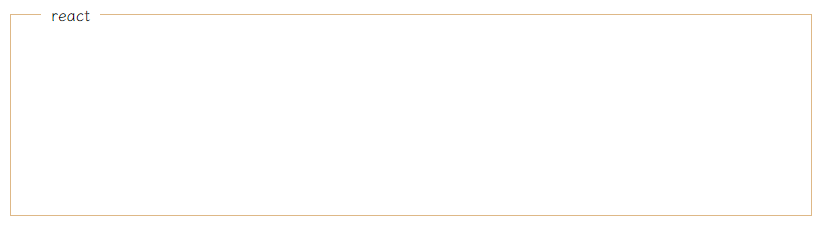

### css效果-文字嵌入边框

最终效果如下:



html代码如下:
```html
    <div id="container"></div>
```

css代码如下:
```css
    <style>
        * {
            padding: 0;
            margin: 0;
        }
        #container {
            width: 800px;
            height: 200px;
            border: 1px solid burlywood;
            position: relative;
            margin: 20px;
        }

        #container:before {
            content: 'react';
            position: absolute;
            padding: 0 10px;
            top: 0;
            left: 20px;
            transform: translate(0,-50%);
            background-color: #fff;
        }

    </style>
```
我们使用了伪类来构建内容，这样少创建了html的元素。
关键代码是这三行css代码:
```css
   #container:before {
    /* 省略 */
        top: 0;
        transform: translate(0,-50%);
        background-color: #fff;
    }
```

top: 0; transform: translate(0,-50%);这两行代码把文字自身能够在边框中垂直居中呈现。
background-color: #fff; 这一行代码把文字的背景色设置为背景色(我们这里是白色)。