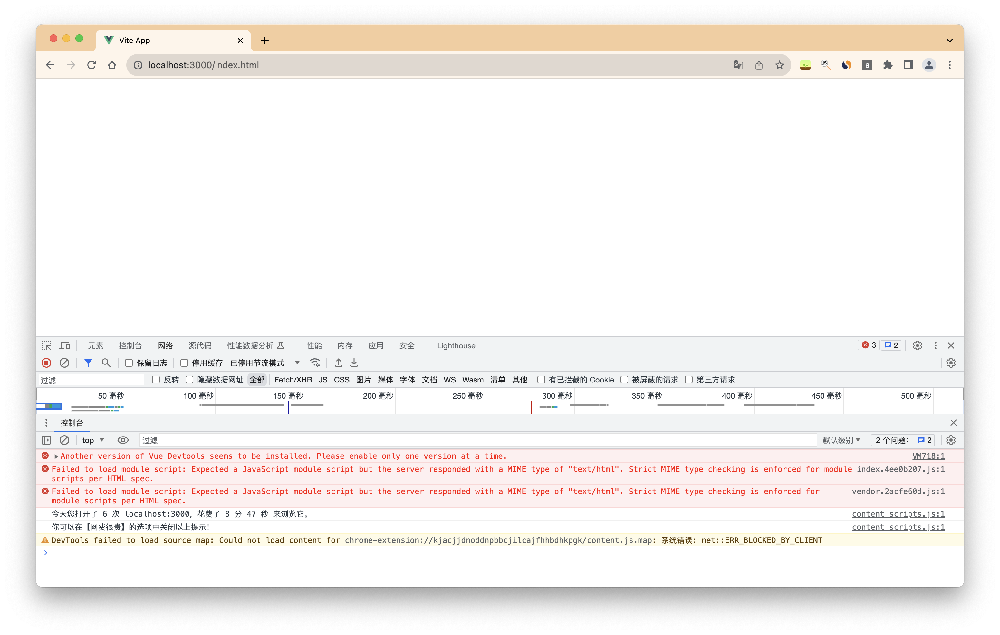
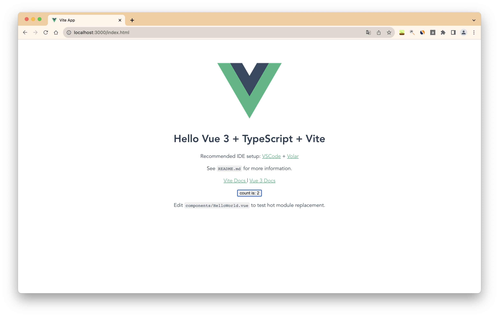
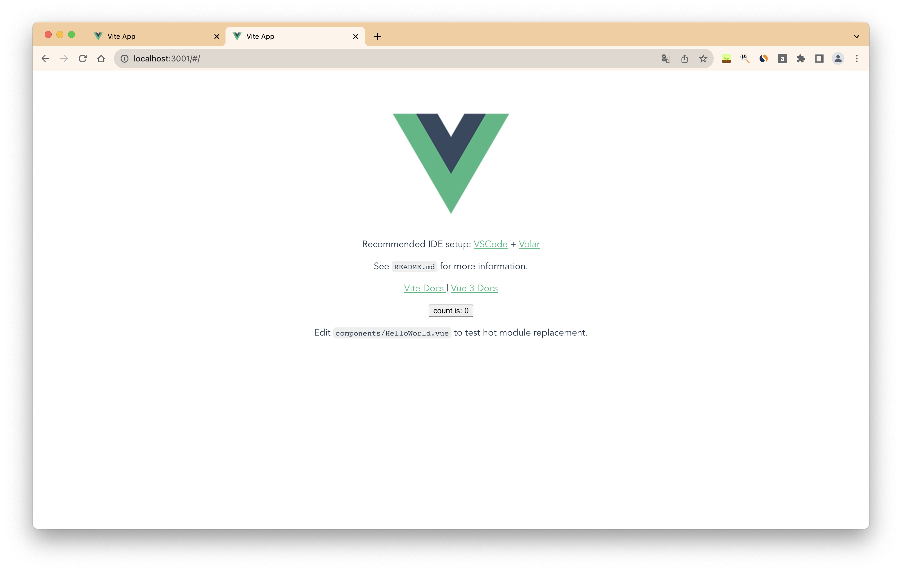
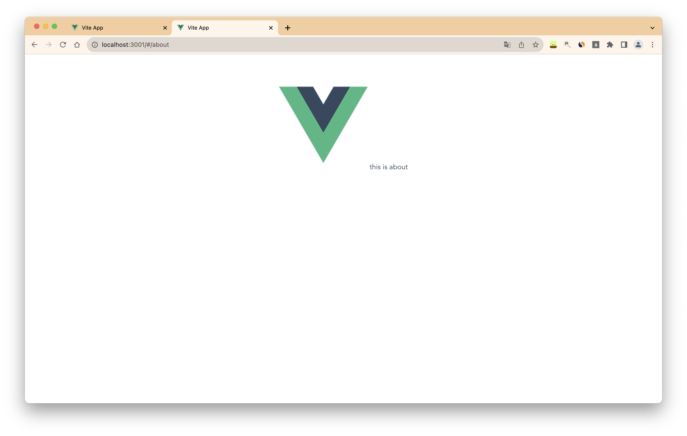

# 本地启动服务查看打包后的项目文件

前端项目打包后，会在目录中生成一个dist文件。我们把这个dist文件放到远程服务器来访问它。

但是，如果我们本地要查看这个文件，怎么办呢？
此时我们就需要本地启动一个node服务，当浏览器请求dist中的index.html文件时，node服务会返回该文件。

这里我用vite构建的vue项目为例，执行`npm run build`，生成dist目录。
dist目录有了，下面开始写node代码。

### node 创建服务器

首先我们本地要启动一个node服务器，代码如下：

```node
// localServer.js
const http = require('http')
const fs = require('fs')
const path = require('path')

const server = http.createServer((req, res) => {
  const url = req.url
  const filePath = path.join(__dirname, 'dist', url)
  // 读取文件
  fs.readFile(filePath, (err, data) => {
    if (err) return
    res.writeHead(200, {
      'Content-Type': 'text/html;charset=utf-8'
    })
    res.end(data)
  })
})

server.listen(3000, () => {
  console.log('本地服务器启动成功')
})
```

执行该代码后，一个node服务会运行在本地3000端口上。打开浏览器访问下。


页面是空白的，但仔细看下发现控制台里面有报错。

 Failed to load module script: Expected a JavaScript module script but the server responded with a MIME type of "text/html". Strict MIME type checking is enforced for module scripts per HTML spec.

 这一段意思是，由于我们服务器返回了一个js文件，但是http响应头返回文件类型是`text/html` 导致浏览器用解析`html`的方式来解析了js文件，从而解析失败。

 我们仅仅访问了`localhost:3000/index.html`， 为什么会访问到了额外的js文件？

 我们可以看下`dist/index.html`文件内容：
 ```html
<!DOCTYPE html>
<html lang="en">
  <head>
    <!-- 省略内容 -->
    <script type="module" crossorigin src="/assets/index.4ee0b207.js"></script>
    <link rel="modulepreload" href="/assets/vendor.2acfe60d.js">
  </head>
  <body>
    <!-- 省略内容 -->
  </body>
</html>
 ```

关键是如下两行代码：
```html
<script type="module" crossorigin src="/assets/index.4ee0b207.js"></script>
<link rel="modulepreload" href="/assets/vendor.2acfe60d.js">
```
我们在解析html标签的时候会访问这两个js文件。

所以我们修改下node服务，让它的相应头类型能够根据读取到的文件类型来判断。

```node
// 省略部分代码
const mime = require('mime')

const server = http.createServer((req, res) => {
  // 省略部分代码
  // 读取文件
  fs.readFile(filePath, (err, data) => {
    if (err) return
    res.writeHead(200, {
      // 修改后
      'Content-Type': mime.getType(filePath)
    })
    res.end(data)
  })
})

```

这段代码中我们新增了一个`mime`的包，用来判断当前文件的响应头类型。

我们再次访问`localhost:3000`，发现首页内容已经正常展示了。


#### 有vue-router查看具体路由页面

我们考虑有路由的情况

当请求的url非首页(index.html)时，我们强制重定向到首页。
```node
// 添加代码
const isRouteRequest = (uri) => {
  // 判断请求url中的最后一个路径是否是index.html
  return uri.split('/').pop().indexOf('.') === -1 ? true : false
}


const server = http.createServer((req, res) => {
  let url = req.url
  let isRouterUrl = isRouteRequest(req.url)
  if (isRouterUrl) url = 'index.html'
  const filePath = path.join(__dirname, 'dist', url)

  // 读取文件
  fs.readFile(filePath, 'binary', (err, data) => {
    if (err) return
    res.writeHead(isRouterUrl ? 301 : 200, {
      'Content-Type': mime.getType(filePath)
    })
    res.write(data, 'binary')
    res.end()
  })
})
```

浏览器访问`localhost:3000/#/`，`localhost:3000/#/about`




参考链接：
- [http-server-spa](https://www.npmjs.com/package/http-server-spa?activeTab=code)