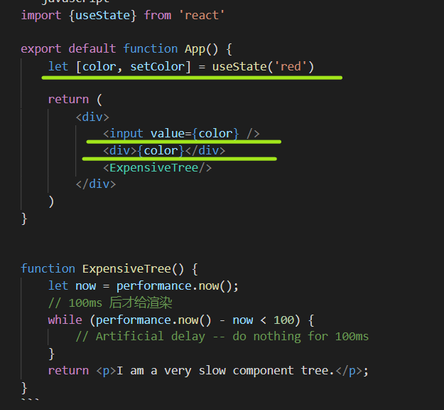

## 优秀的组件

### 组件属性发生变化后 应只要修改属性变化的部分 其余部分不应该重新渲染
```javascript
import {useState} from 'react'

export default function App() {
    let [color, setColor] = useState('red')

    return (
        <div>
            <input value={color} />
            <div>{color}</div>
            <ExpensiveTree/>
        </div>
    )
}


function ExpensiveTree() {
    let now = performance.now();
    // 100ms 后才给渲染
    while (performance.now() - now < 100) {
        // Artificial delay -- do nothing for 100ms
    }
    return <p>I am a very slow component tree.</p>;
}
```

这个App组件中，color变化后，整个App都会重新渲染，也就是input, div, ExpensiveTree组件都被渲染了一次。
但是ExpensiveTree组件是一个要消耗100ms的组件，每次渲染浪费的时间太多。所以我们要优化下。

### 解法1： 移动color属性



App里面只有这一部分用到了color属性，所以这一部分就可以提取成为一个组件
```javascript
import {useState} from 'react'

export default function App() {
    let [color, setColor] = useState('red')

    return (
        <div>
            <Form/>
            <ExpensiveTree/>
        </div>
    )
}

function Form() {
    let [color, setColor] = useState('red')
    return (
        <div>
            <input value={color} />
            <div>{color}</div>
        </div>
    )
}


function ExpensiveTree() {
    // xxxx
}

```

color 改动后，只有Form 会被渲染。ExpensiveTree不受影响。