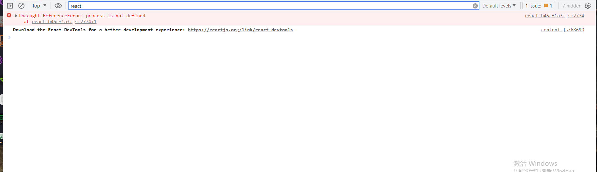
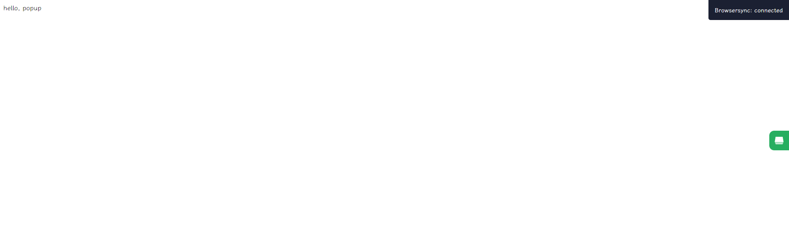

### 新建项目 安装依赖

```bash
mkdir chrome-extension && cd chrome-extension && npm init -y

# TODO: 省略 新建src
```

### 项目配置

首先新建public文件夹，里面存放插件的manifest.json文件。
```json
{
  "name": "extension-name",
  "description": "extension description",
  "version": "0.1",
  "manifest_version": 3,
  "action": {
    "default_popup": "popup.html"
  },
  "content_scripts": [
    {
      "matches": ["http://*/*", "https://*/*", "<all_urls>"],
      "js": ["content.js"]
    }
  ],
  "permissions": ["storage"]
}


```

> 这边目前只配置了popup.html，options.html，content.js。如果需要其他文件，可以自行添加。

#### popup页面

然后我们来写popup的页面，这边使用react + tailwindcss来开发。

安装下对应依赖
```bash
npm i react react-dom 
```
> tailwindcss 需要配置 后面会安装

页面代码如下：
```js
// popup/popup.tsx
import { createRoot } from 'react-dom/client'
import React from 'react'


function App() { 
    return <div>
        hello, popup
    </div>
}

const root = createRoot(document.getElementById('root')!)
root.render(<App />)
```

这就是页面的全部内容，但是这个popup.tsx并不是我们最终效果，浏览器最后只能认识popup.html，所以我们用使用rollup把popup.tsx编译成popup.html。


首先要安装依赖
```bash
npm i rollup tslib typescript @rollup/plugin-typescript @rollup/plugin-commonjs @rollup/plugin-node-resolve @babel/core @rollup/plugin-babel @babel/preset-react @babel/preset-env -D
```

解释下依赖作用：
- `typescript` `tslib` `@rollup/plugin-typescript` rollup用来编译ts，tsx文件
- `@rollup/plugin-commonjs` rollup能够打包CommonJs模块
- `@rollup/plugin-node-resolve` rollup能够打包node_modules中的文件
- `@babel/core` `@rollup/plugin-babel` `@babel/preset-react` `@babel/preset-env`  rollup能够使用babel

上面我们只安装typescript还不够，我们要创建ts的配置文件tsconfig.json。
```json
{
    "compilerOptions": {
      "target": "es5",
      "lib": ["dom", "dom.iterable", "esnext"],
      "module": "ESNext",
      "jsx": "react",
      "outDir": "./dist",
      "moduleResolution": "Node",
      "types": ["@types/chrome"],
    },
    "include": ["src/**/*"],
    "exclude": ["node_modules"]
  }
```
其中配置了 "types": ["@types/chrome"], 我们的ts文件中就有chrome类型提示了。


新建rollup.config.js。
```js
// rollup.config.js
import typescript from "@rollup/plugin-typescript";
import commonjs from "@rollup/plugin-commonjs";
import resolve from "@rollup/plugin-node-resolve";
import babel from "@rollup/plugin-babel";

/** @type {import('rollup').RollupOptions} */
export default {
  // 当前入口 popup.tsx
  input: ["src/popup/popup.tsx"],
  output: {
    dir: "./dist",
    entryFileNames: "[name].js",
    format: "es",
    // 手动拆出 react react-dom
    manualChunks: {
      react: ["react"],
      "react-dom": ["react-dom"],
    },
  },
  plugins: [
    typescript(),
    commonjs(),
    resolve(),
    babel({
      presets: ["@babel/preset-react"],
      babelHelpers: "bundled",
      extensions: [".js", ".jsx", ".es6", ".es", ".mjs", ".ts", ".tsx"],
      plugins: [],
    }),
  ],
};
```

配置package.json，配置启动命令。
```json
{
  // xxx
  // rollup.config.js中使用了 export default {} 的esModule语法，这边要配置esModule为默认模块
  "type": "module",
  "scripts": {
    "dev": "rollup -c -w",
  }
}
```

这边执行命令`npm run dev`, 可以看到dist目录下生成了popup.js文件。


此时js生成了，但我们最终需要的是popup.html文件。rollup现在只能把我们的popup.tsx转换成popup.js，现在要生成一个popup.html，它的script指向popup.js。

想要rollup生成html，需要用到@rollup/plugin-html。
```bash
npm i @rollup/plugin-html -D
```

由于@rollup/plugin-html插件不支持导入本地文件模板，对应的html模板需要我们自己配置：

```js
// plugin/html.js
import { makeHtmlAttributes } from "@rollup/plugin-html";

export const generateHtmlPlugin = (htmlName) => {
  return {
    fileName: `${htmlName}.html`,
    template: ({ attributes, files, publicPath, title }) => {
      let scripts = [
        ...(files.js || []).filter((item) => item.name === htmlName),
      ];
      scripts = scripts
        .map(({ fileName }) => {
          const attrs = makeHtmlAttributes(attributes.script);
          return `<script src="${publicPath}${fileName}"${attrs}></script>`;
        })
        .join("\n");
      return `<!DOCTYPE html>
          <html>
            <head>
              <title>${title}</title>
            </head>
            <body>
              <div id="app"></div>
              ${scripts}
            </body>
          </html>`;
    },
  };
};
```

在rollup.config.js中引入插件：
```js
// rollup.config.js
// ...
import html from "rollup-plugin-generate-html-template";
import {generateHtmlPlugin} from './plugin/html'

export default {
  // ...
  plugins: [
    // ...
    html(generateHtmlPlugin('popup')),
  ]
}
```

再次执行`npm run dev`，可以看到生成的打包生成popup.html。

我们在vsCode中安装`Live-Server`插件，然后在本地打开popup.html，可以看到页面无法正常显示，我们打开控制台工具，发现有报错。



原因是，react源码中是commonjs模块，里面使用了`process.env.NODE_ENV`，然后我们现在是浏览器环境，没有process对象，所以报错。

解决办法也很简单，我们可以把`process.env.NODE_ENV`根据打包环境替换为prod,dev等。

对此我们要安装下`cross-env`，`@rollup/plugin-replace`。

修改下package.json:
```json
{
  "scripts": {
    "dev": "cross-env NODE_ENV=development rollup -c -w",
    "build": "cross-env NODE_ENV=production rollup -c"
  }
}
```
开发生产的的时候设置对应的环境变量。

修改下rollup.config.js
```js
// ...
import replace from '@rollup/plugin-replace';

export default {
  // ...
  plugins: [
    // ...
    replace({
      values: {
        "process.env.NODE_ENV": JSON.stringify(process.env.NODE_ENV),
      },
      preventAssignment: true,
    })
  ]
}

```

再次执行`npm run dev`，可以看到页面正常显示了。


但这还不行，我们最后要的是一个chrome插件，现在的dist目录中还缺少chrome插件需要的manifest.json文件。

我们的manifest.json文件在public目录下面，要让rollup打包的时候放到dist目录下面。我们使用`rollup-plugin-copy`插件。

```bash
npm i -D rollup-plugin-copy
```

```js
// rollup.config.js
// ...
import copy from 'rollup-plugin-copy';

export default {
  // ...
  copy({
    targets: [{ src: "public/**", dest: "dist/" }],
  }),
}
```

再次执行`npm run dev`，可以看到dist目录下面有了manifest.json文件。

但由于manifest.json文件中引用了`content.js`, `options.html`文件，我们还需要将对应的文件打包。

新建src/options/options.tsx
```js
import { createRoot } from 'react-dom/client'
import React from 'react'

function App() { 
    return <div>
        hello, options
    </div>
}

const root = createRoot(document.getElementById('root')!)
root.render(<App />)
```

新建src/content/content.js
```js
console.log('content')
```

rollup中添加`content.js`, `options.html`文件的入口。
```js
// rollup.config.js
export default {
  // ...
  input: ['src/popup/popup.tsx', 'src/options/options.tsx', 'src/content/content.js']，

  // ...
  plugins: [
     html({
      ...generateHtmlPlugin("popup"),
      ...generateHtmlPlugin("options"),
    })
  ]
}
```

再次允许`npm run dev`，生成dist文件后。使用chrome插件中加载dist目录。


popup 页面已经完成。

我们修改下popup.tsx, 里面添加跳转options.html的逻辑。

```js
// popup.tsx
function App() {

    const toSetting = () => {
        if (chrome.runtime.openOptionsPage) {
            chrome.runtime.openOptionsPage();
        } else {
            window.open(chrome.runtime.getURL('options.html'));
        }
    }

    return <div style={{width: '300px', height: '400px'}}>
        hello, popup
        <div>
            <button onClick={toSetting}>设置</button>
        </div>
    </div>
}
```

等加载完毕后，点击设置跳转到了options.html页面。


