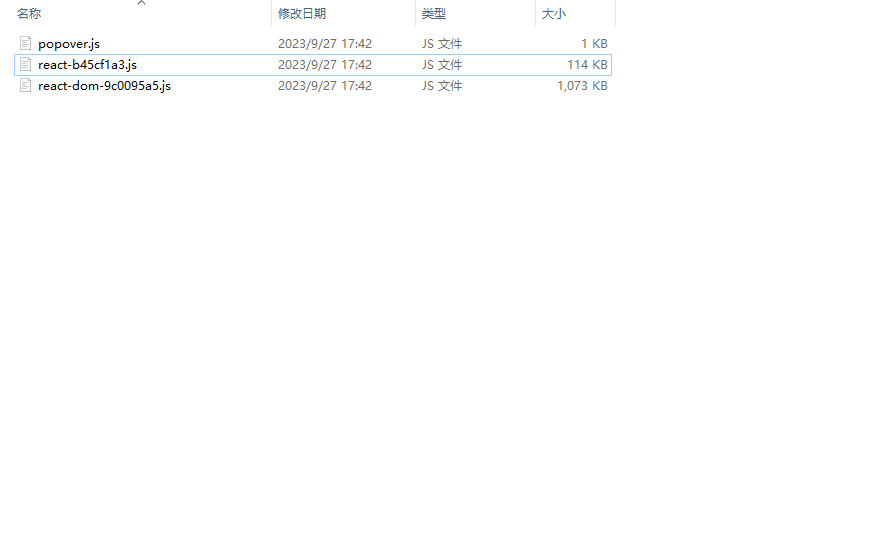

### 新建项目 安装依赖

```bash
mkdir chrome-extension && cd chrome-extension && npm init -y

# TODO: 省略 新建src
```

### 项目配置

首先新建public文件夹，里面存放插件的manifest.json文件。
```json
{
  "name": "extension-name",
  "description": "extension description",
  "version": "0.1",
  "manifest_version": 3,
  "action": {
    "default_popup": "popup.html"
  },
  "options_page": "options.html",
  "content_scripts": [
    {
      "matches": ["http://*/*", "https://*/*", "<all_urls>"],
      "js": ["content.js"]
    }
  ],
  "permissions": ["storage"]
}

```

> 这边目前只配置了popup.html，options.html，content.js。如果需要其他文件，可以自行添加。

#### popup页面

然后我们来写popup的页面，这边使用react + tailwindcss来开发。

安装下对应依赖
```bash
npm i react react-dom 
```
> tailwindcss 需要配置 后面会安装

页面代码如下：
```js
// popup/popup.tsx
import { createRoot } from 'react-dom/client'
import React from 'react'


function App() { 
    return <div>
        hello, popup
    </div>
}

const root = createRoot(document.getElementById('root')!)
root.render(<App />)
```

这就是页面的全部内容，但是这个popup.tsx并不是我们最终效果，浏览器最后只能认识popup.html，所以我们用使用rollup把popup.tsx编译成popup.html。


首先要安装依赖
```bash
npm i rollup tslib typescript @rollup/plugin-typescript @rollup/plugin-commonjs @rollup/plugin-node-resolve @babel/core @rollup/plugin-babel @babel/preset-react @babel/preset-env -D
```

解释下依赖作用：
- `typescript` `tslib` `@rollup/plugin-typescript` rollup用来编译ts，tsx文件
- `@rollup/plugin-commonjs` rollup能够打包CommonJs模块
- `@rollup/plugin-node-resolve` rollup能够打包node_modules中的文件
- `@babel/core` `@rollup/plugin-babel` `@babel/preset-react` `@babel/preset-env`  rollup能够使用babel

上面我们只安装typescript还不够，我们要创建ts的配置文件tsconfig.json。
```json
{
    "compilerOptions": {
      "target": "es5",
      "lib": ["dom", "dom.iterable", "esnext"],
      "module": "ESNext",
      "jsx": "react",
      "outDir": "./dist",
      "moduleResolution": "Node",
      "types": ["@types/chrome"],
    },
    "include": ["src/**/*"],
    "exclude": ["node_modules"]
  }
```
其中配置了 "types": ["@types/chrome"], 我们的ts文件中就有chrome类型提示了。


新建rollup.config.js。
```js
// rollup.config.js
import typescript from "@rollup/plugin-typescript";
import commonjs from "@rollup/plugin-commonjs";
import resolve from "@rollup/plugin-node-resolve";
import babel from "@rollup/plugin-babel";

/** @type {import('rollup').RollupOptions} */
export default {
  // 当前入口 popover.tsx
  input: ["src/popover/popover.tsx"],
  output: {
    dir: "./dist",
    entryFileNames: "[name].js",
    format: "es",
    // 手动拆出 react react-dom
    manualChunks: {
      react: ["react"],
      "react-dom": ["react-dom"],
    },
  },
  plugins: [
    typescript(),
    commonjs(),
    resolve(),
    babel({
      presets: ["@babel/preset-react"],
      babelHelpers: "bundled",
      extensions: [".js", ".jsx", ".es6", ".es", ".mjs", ".ts", ".tsx"],
      plugins: [],
    }),
  ],
};
```

配置package.json，配置启动命令。
```json
{
  // xxx
  // rollup.config.js中使用了 export default {} 的esModule语法，这边要配置esModule为默认模块
  "type": "module",
  "scripts": {
    "dev": "rollup -c -w",
  }
}
```

这边执行命令`npm run dev`, 可以看到dist目录下生成了popover.js文件。



此时js生成了，但我们最终需要的是popup.html文件。


