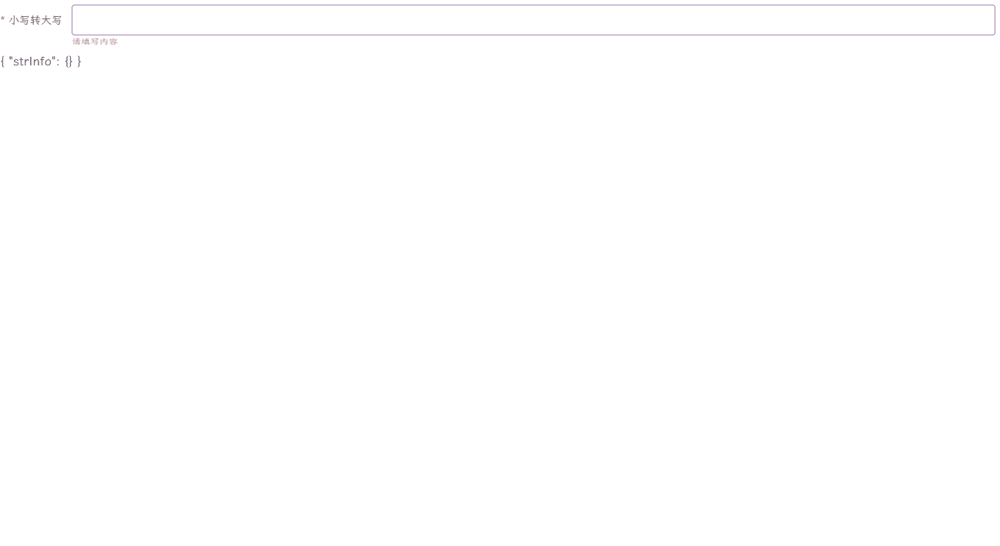

# 使用useDebounceFn后表单验证错误问题


## 案例复现
有如下一个场景：
使用`element-ui`创建的表单中，有个表单项，其中有一个自定义组件(TrickyComponent)，代码如下：
```vue
<template>
  <div>
    <el-form :model="formValue" :rules="rules">
      <el-form-item prop="uppercase" label="小写转大写">
        <TrickyComponent v-model:modelValue="formValue.strInfo" />
      </el-form-item>
    </el-form>
  </div>
</template>

```

其中`TrickyComponent`使用`v-model`绑定了`formValue.strInfo`。这个`formValue.strInfo`是个对象，里面有`uppercase`和`originStr`两个属性。其中`uppercase`是我们要验证的表单项。这段对应代码如下：
```vue
<script setup>
import { reactive, watchEffect } from "vue";
import { ElForm, ElFormItem } from "element-plus";
import TrickyComponent from "./TrickyComponent";

const formValue = reactive({
  originStr: "",
  uppercase: "",
  strInfo: {},
});

// 从strInfo中获取originStr和uppercase
watchEffect(() => {
  const { originStr, uppercase } = formValue.strInfo;
  formValue.uppercase = uppercase;
  formValue.originStr = originStr;
});

// 表单验证
const rules = reactive({
  uppercase: [
    {
      required: true,
      message: "请填写内容",
      trigger: ["blur", "change"],
    },
  ],
});
</script>
```


`TrickyComponent`的代码如下：
```vue
<template>
  <el-input @input="handleInput" v-model.trim="keyword" />
</template>

<script setup>
import { ElInput } from "element-plus";
import { useDebounceFn } from "@vueuse/core";
import { computed, watchEffect, ref } from "vue";
defineProps({
  modelValue: {},
});
const emits = defineEmits(["update:modelValue"]);

const keyword = ref("");
const keywordInfo = ref({});

const handleInput = useDebounceFn((val) => {
  keywordInfo.value = {
    originStr: val,
    uppercase: val.toUpperCase(),
  };

  keyword.value = keywordInfo.value.originStr;
  emits("update:modelValue", keywordInfo.value);
}, 500);
</script>
```

代码如上([codePen链接](https://codesandbox.io/s/pedantic-mclean-q2ljv5?file=/src/TrickyComponent.vue:0-643))，表单验证的时候出现了怪现象：



1. 输入框已经输入值后，但是表单不为空的检验依旧出现。
2. 当我置空输入框的时候，本该出现的表单验证却没有出现。

先说结论： `TrickyComponent` 内部`el-input`组件监听了`input`事件()
```html
  <!-- TrickyComponent -->
  <el-input @input="handleInput" v-model.trim="keyword" />
```

其中`handleInput`使用了`@vueuse/core`(版本9.13.0)中的防抖函数`useDebounceFn`
```javascript
const handleInput = useDebounceFn((val) => {
  keywordInfo.value = {
    originStr: val,
    uppercase: val.toUpperCase(),
  };
}, 500);
```

但是这个`useDebounceFn`触发时机是最后一次`input`行为后的500ms，此时keyWordInfo会被更新。但是与此同时`el-input`输入值的时候会触发`change`事件，然后会触发表单的校验，由于`change`事件的触发没有使用`useDebounceFn`包装，此时`change`事件中获取的值还不是更新的值。导致表单校验的值获取错误。

解决办法：
1. 表单规则中取消`change`事件的触发条件，监听`formValue.strInfo`值的变化来触发表单验证。

```javascript
// 表单验证
const rules = reactive({
  uppercase: [
    {
      required: true,
      message: "请填写内容",
      trigger: ["blur"],
    },
  ],
});

watchEffect(() => {
  if (!formValue.strInfo.init) {
    const { originStr, uppercase } = formValue.strInfo;
    formValue.uppercase = uppercase;
    formValue.originStr = originStr;
    // 去除页面初始化的验证
    formRef.value?.validateField("uppercase");
  }
});
```

## element-plus 源码部分

### el-input 校验部分
```javascript
const elForm = inject(elFormKey, undefined)
const elFormItem = inject(elFormItemKey, undefined)

watch(
  () => props.modelValue,
  () => {
    nextTick(resizeTextarea)
    if (props.validateEvent) {
      elFormItem?.validate?.('change')
    }
  }
)
```